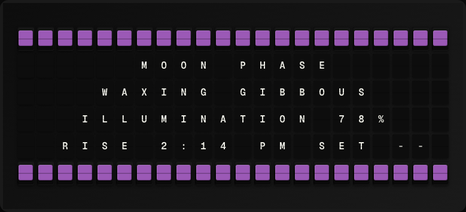

# Moon Phase Plugin

Display the current moon phase and illumination percentage.



**→ [Setup Guide](./docs/SETUP.md)**

## Overview

The Moon Phase plugin queries the US Naval Observatory API for lunar phase data. It shows the current phase name (New Moon, Waxing Crescent, etc.) and the percentage of the Moon that is illuminated. No API key is required.

## Template Variables

| Variable | Description | Example |
|---|---|---|
| `moon_phase.phase` | Current moon phase name | `Waxing Crescent` |
| `moon_phase.illumination` | Percentage of illumination (0-100) | `42.5` |
| `moon_phase.next_full_moon` | Date of next full moon (YYYY-MM-DD) | `2026-05-12` |

## Example Templates

```
MOON PHASE
{{moon_phase.phase}}
Illumination: {{moon_phase.illumination}}%
Next Full:
{{moon_phase.next_full_moon}}

```

## Configuration

| Setting | Name | Description | Required |
|---|---|---|---|
| `refresh_seconds` | Refresh Interval | How often to fetch data (seconds) | No |

## Features

- Current moon phase name
- Illumination percentage
- Next full moon date
- No API key required

## Author

FiestaBoard Team
